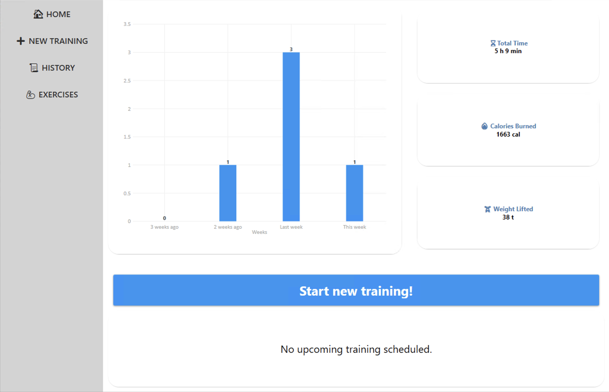

# Workout Tracker  
*A WPF desktop app for tracking gym sessions with exercise discovery and progress analytics.*

  

## Key Features  
- **Workout Logging** - Track sets, reps, weights and duration  
- **Exercise Library** - Browse exercises by muscle group (via external API)  
- **Progress Charts** - LiveCharts2
- **Offline Storage** - All data saved locally
- **Clean UI** - Material Design interface  

## How to run 
**Clone the repository** in Visual Studio:
   ```bash
   git clone https://github.com/samuelkocych/workout-tracker.git
